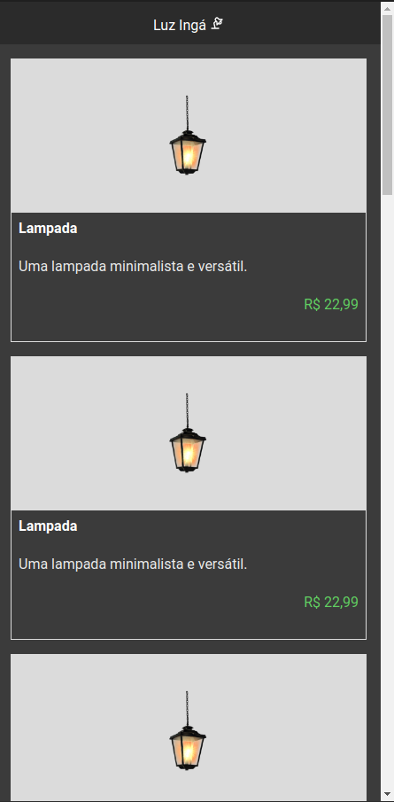
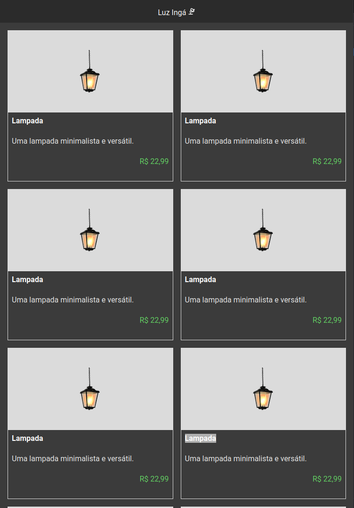
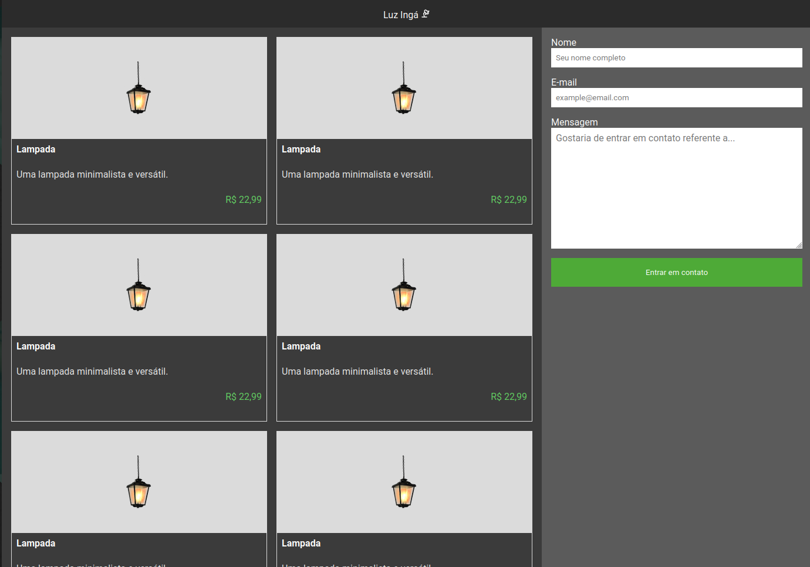
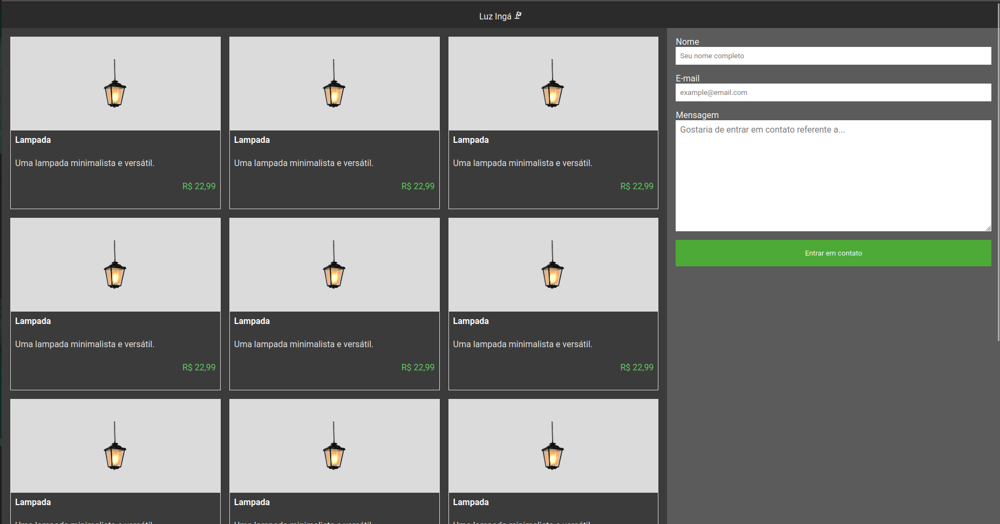

# Luz Ingá

Pagina simples para a venda de produtos de uma empresa fictícia chamada Luz Ingá.

Aqui é possível encontrar os seguintes conceitos:

 - HTML semântico
 - Responsividade
 - Flexbox
 - Grid
 - Google fonts
 - Manipulação do DOM
 - E muito mais

> Esse projeto é uma boa fonte de consulta para entender como algumas tecnologias básicas modernas funcionam, caso tenha alguma duvida referente ao projeto basta entrar em contato.

## Responsividade

O projeto é responsivo, se adaptando para varias interfaces
### Mobile

### Tablet

### Desktop1

### Desktop2
